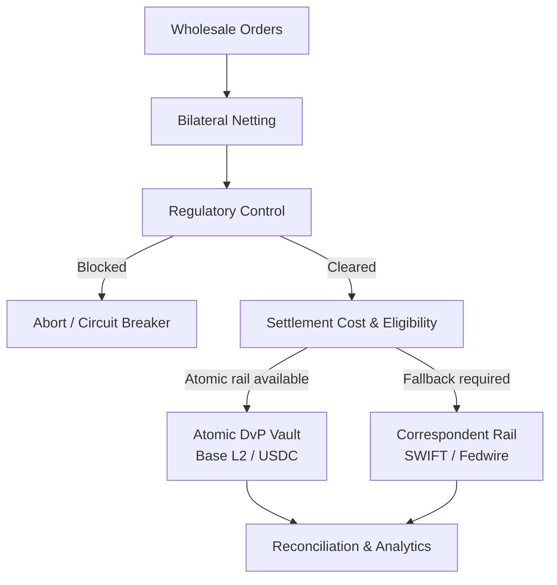
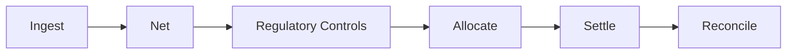

from pathlib import Path

readme = r'''# dvp-settlement-agent

[](https://opensource.org/licenses/MIT)
[](https://www.python.org/)
[](https://getfoundry.sh/)
[](https://langchain-ai.github.io/langgraph/)

**Autonomous Delivery-versus-Payment (DvP) Clearing & Settlement Engine**

Institutional-style infrastructure prototype combining bilateral netting, settlement-cost optimisation, deterministic regulatory controls, atomic on-chain settlement, and conventional payment-rail fallback.

> **Prototype:** Research and engineering implementation. Not production financial-market infrastructure.

---

## Architecture



The settlement-critical path is deterministic. The agentic layer orchestrates workflow state but does not receive unrestricted authority to move assets.

---

## Core Workflow



### Settlement invariant

```text
Delivery ⇔ Payment
```

The `OffExchangeVault` contract is designed so that the linked settlement legs execute atomically or do not execute.

---

## Modules

| Module | Purpose |
|---|---|
| `compliance_engine.py` | Entity normalisation, screening and regulatory controls |
| `netting_engine.py` | Gross-to-net bilateral obligation compression |
| `cost_engine.py` | Settlement friction and capital opportunity-cost model |
| `workflow.py` | Deterministic settlement state graph |
| `agents.py` | LangGraph workflow orchestration |
| `onchain_bridge.py` | Python-to-EVM settlement interface |
| `state.py` | Settlement state schemas |
| `analytics.py` | Clearing and capital-velocity metrics |
| `simulation.py` | Benchmark cohort simulation |
| `demo.py` | Interactive settlement demonstration |
| `contracts/src/OffExchangeVault.sol` | Atomic DvP escrow contract |
| `contracts/test/OffExchangeVault.t.sol` | Contract tests and invariants |

---

## Economic Model

### Legacy correspondent rail

```text
Friction_legacy =
    SWIFT_Tariff
    + Intermediary_Bps
    + (Notional × SOFR × 48 / 8640)
```

### Atomic settlement rail

```text
Friction_atomic =
    (Gas_Used × BaseFee × ETH_USD)
    + (Notional × SOFR × 0.25 / 8640)
```

The model compares transaction execution cost with the opportunity cost of capital tied up during settlement.

---

## Regulatory Controls

The compliance layer demonstrates deterministic pre-settlement controls using:

- OFAC SDN and alternate-name datasets
- Entity-name normalisation
- Token-based / Levenshtein matching
- Configurable jurisdictional risk rules
- Circuit-breaker routing before capital movement

The implementation is intended to demonstrate **regulatory control architecture and auditability**, not to provide legal or compliance advice.

Production deployment would require current authoritative datasets, versioning, audit trails, escalation workflows and human review.

---

## Benchmark

### $128.5M wholesale cohort

| Metric | Result |
|---|---:|
| Gross input volume | **$128.5M** |
| Cleared volume | **$108.5M** |
| Blocked volume | **$20.0M** |
| Gross exposure | **$128.5M** |
| Net exposure | **$114.5M** |
| Liquidity released | **$14.0M** |
| Capital compression | **10.89%** |

### Settlement allocation

| Rail | Orders | Volume | Modelled friction |
|---|---:|---:|---:|
| Atomic on-chain | 2 | $23.5M | **$51.20** |
| Correspondent | 8 | $85.0M | **$24,786.67** |

> Benchmark figures are modelled results from the project simulation, not observed market savings.

---

## Technology

- **Python 3.11+**
- **LangGraph / LangChain**
- **Solidity + Foundry**
- **Base L2 / USDC**
- **web3.py / Coinbase AgentKit**
- **FastAPI / Uvicorn**
- **SQLite**
- **OFAC / FATF reference data**

---

## Quick Start

```bash
git clone git@github.com:alexander-jhughes/dvp-settlement-agent.git
cd dvp-settlement-agent

python3.11 -m venv .venv
source .venv/bin/activate
pip install -r requirements.txt
```

### Test contracts

```bash
cd contracts
forge build
forge test -vv
cd ..
```

### Run the demo

```bash
python demo.py
```

### Run the benchmark

```bash
python simulation.py
```

---

## Project Structure

```text
dvp-settlement-agent/
├── contracts/
│   ├── src/OffExchangeVault.sol
│   └── test/OffExchangeVault.t.sol
├── compliance_engine.py
├── cost_engine.py
├── netting_engine.py
├── onchain_bridge.py
├── agents.py
├── state.py
├── workflow.py
├── analytics.py
├── simulation.py
├── demo.py
└── requirements.txt
```

---

## Design Principles

**Net before settlement**  
Reduce gross liquidity requirements before execution.

**Controls before commitment**  
Regulatory and eligibility checks occur before capital movement.

**Atomic where possible**  
Link delivery and payment through the settlement contract.

**Deterministic execution**  
Agents orchestrate the workflow; deterministic controls govern settlement.

**Fail closed**  
Uncertain or failed critical controls prevent execution or trigger the fallback path.

---

## Institutional Context

The architecture is informed by established financial-market-infrastructure concepts, including:

- **BIS CPMI-IOSCO Principles for Financial Market Infrastructures**, particularly DvP
- **U.S. Treasury OFAC** sanctions-screening infrastructure
- **FATF** jurisdictional risk frameworks
- **Federal Reserve Bank of New York SOFR** as a funding-rate benchmark

These references inform the system design and do not imply regulatory approval or production certification.

---

## Limitations

This is a research prototype. Production deployment would additionally require independent smart-contract assurance, key management, finality controls, operational resilience, cybersecurity, legal analysis, custody controls, comprehensive AML/KYC processes, participant governance, and formal regulatory approval where applicable.

The benchmark is sensitive to assumptions including funding rates, settlement latency, intermediary pricing, gas costs, and transaction topology.

---

## Roadmap

- [ ] Multi-currency settlement
- [ ] Multi-chain routing
- [ ] Real-time FX
- [ ] LEI / beneficial-ownership integration
- [ ] Versioned regulatory data
- [ ] Human-in-the-loop review
- [ ] Formal contract verification
- [ ] Liquidity stress testing
- [ ] Settlement finality monitoring
- [ ] Production observability

---

## License

MIT
'''

path = Path("/mnt/data/README_concise_mermaid.md")
path.write_text(readme, encoding="utf-8")
print(f"Created: {path}")
print(f"Size: {path.stat().st_size:,} bytes")
